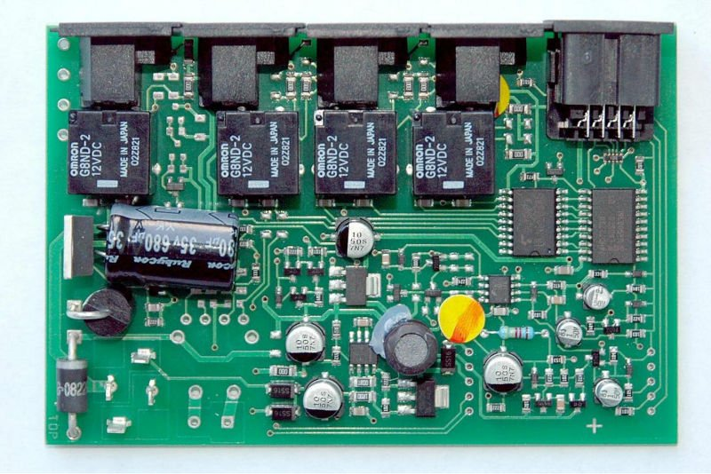

# GEEA - Grupo de Estudo de Eletrônica e Arduino

Grupo que tem o objetivo de incentivar o aprendizado sobre microeletrônica e Arduíno, através de encontros presenciais para compartilhamento de conhecimento, com experiências práticas de conceitos básicos em eletrônica, criação de circuitos, programação, a plataforma Arduíno, sua comunicação com computadores e desenvolver projetos em geral. 

Indicado para todas as pessoas interessadas no assunto, ou seja, não precisa saber nada sobre programação, muito menos sobre eletrônica para participar do GEEA. Indicamos que caso o interessado seja menor de idade, que seja acompanhado por um responsável. 

O método de compartilhamento utilizado são encontros presenciais com datas e horários fixos, com [conteúdo](https://github.com/angelobms/GEEA/blob/master/conteudo.md) compartilhado através da prática, ou seja, alguma informação teórica será apresentada, apenas para embasar a experimentação prática e também disponibilizada aqui no repositório do GEEA. 

Os encontros ocorrem semanalmente apartir das 14:00 às 18:00.

## Tópicos

  1. [O que é Eletrônica?](#o-que-é-eletrônica)
  2. [O que é Arduino?](#o-que-é-arduino)
  3. [Apresentações](#apresentações)
  4. [Artigos](#artigos)
  5. [Vídeos](#videos)
  6. [Livros](#livros)
  7. [Eventos, Cursos e Workshops](#eventos-cursos-e-workshops)
  8. [Meetups](#meetups)
  9. [Ferramentas](#ferramentas)
  10. [Como contribuir](#como-contribuir)
  11. [Exemplos](/exemplos/README.md)
  12. [Projetos do GEEA](/projetos/README.md)

## 1. O que é Eletrônica?

A eletrônica é o ramo da ciência que estuda o uso de circuitos formados por componentes elétricos e eletrônicos, com o objetivo principal de representar, armazenar, transmitir ou processar informações além do controle de processos e servo mecanismos. Também se pode afirmar que os circuitos internos dos computadores (que armazenam e processam informações), os sistemas de telecomunicações (que transmitem informações), os diversos tipos de sensores e transdutores (que representam grandezas físicas - informações - sob forma de sinais elétricos) estão, todos, dentro da área de interesse da eletrônica.

## 2. O que é Arduino?

É uma plataforma de prototipagem eletrônica de hardware livre e de placa única, projetada com um microcontrolador Atmel AVR com suporte de entrada/saída embutido, uma linguagem de programação padrão, a qual tem origem em Wiring, e é essencialmente C/C++. O objetivo do projeto é criar ferramentas que são acessíveis, com baixo custo, flexíveis e fáceis de se usar por artistas e amadores. Principalmente para aqueles que não teriam alcance aos controladores mais sofisticados e de ferramentas mais complicadas.

## 3. Apresentações

## 4. Artigos

[Arduino: hardware e software open-source](http://www.hardware.com.br/artigos/arduino/)

## 5. Videos

## 6. Livros

[Livro de McRoberts](http://raulhc.cc/Doc/LivroArduino) - no site do Raul   
[Make Eletrônics](http://www.makershed.com/products/make-electronics-2ed) - Inglês    
[Arduino Cookbook](http://shop.oreilly.com/product/9780596802486.do) -Inglês        

## 7. Eventos, Cursos e Workshops

## 8. Meetups

## 9. Ferramentas

## 10. Como contribuir

  * Faça um fork do repositório
  * Cria uma branch para sua contribuição: `git checkout -b sua-contribuicao`
  * Commit as mudanças: `git commit -am 'Mensagem sobre a mudança'`
  * Suba as alterações: `git push origin sua-contribuicao`
  * Manda um pull request
